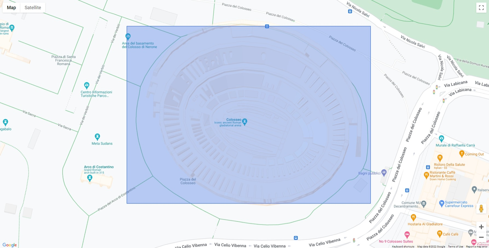

# Google Maps Rectangle

A rectangle placed on top of Rome. Using the Google Maps API.

## Resources

- [Simple polygon](https://developers.google.com/maps/documentation/javascript/examples/polygon-simple) tutorial
